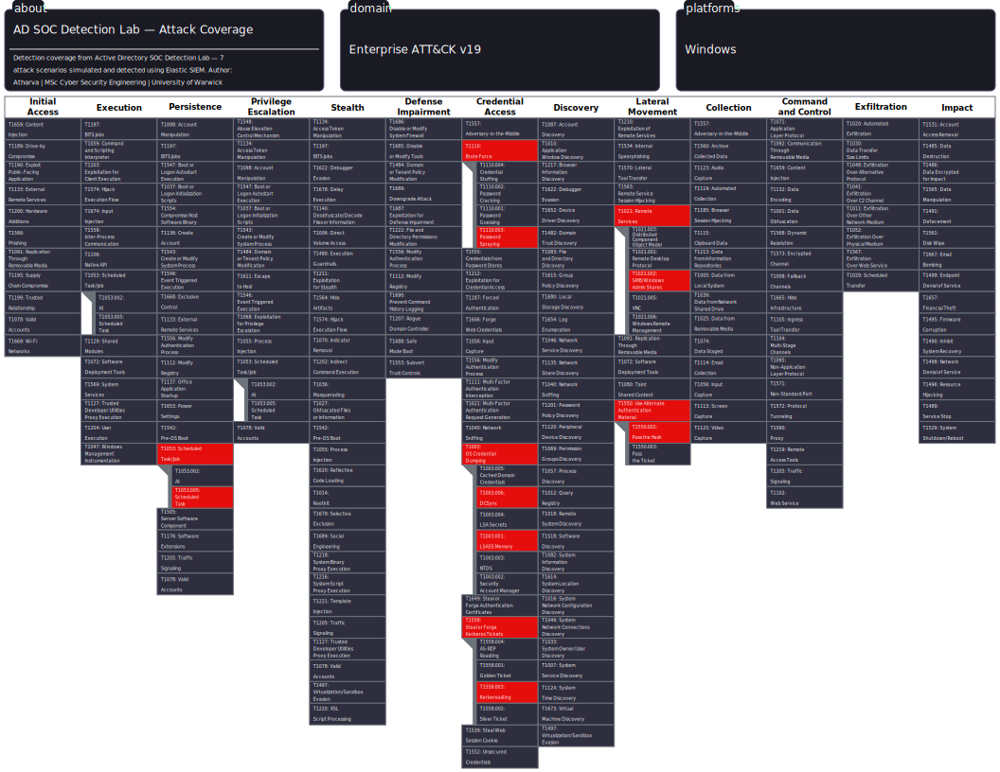

# Active Directory SOC Detection Lab

## Overview
A home lab simulating an enterprise Active Directory environment for hands-on
SOC analyst training. The lab deploys real attack scenarios and builds
detection rules mapped to MITRE ATT&CK using Elastic SIEM.

## Objectives
- Simulate 7 enterprise-grade AD attacks
- Write KQL detection rules for each attack
- Document investigations as formal SOC reports
- Map all detections to MITRE ATT&CK framework

## Lab Architecture

```
Kali Linux (Attacker) ──────────────────────────────────────────┐
                                                                 ▼
Windows 10 (Victim) ──► Sysmon ──► Winlogbeat ──────────────────┐
                                                                 ▼
Windows Server 2022 (DC01) ──► Sysmon ──► Winlogbeat ──► Ubuntu Server (Elastic SIEM)
                                                         Elasticsearch + Kibana
```

## Network Configuration

| VM | Role | IP |
|----|------|----|
| Kali Linux 2026.1 | Attacker | 10.0.0.4 |
| Ubuntu Server 22.04 | Elastic SIEM | 10.0.0.5 |
| Windows Server 2022 | Domain Controller (DC01) | 10.0.0.10 |
| Windows 10 | Victim Endpoint (WIN10-Victim) | 10.0.0.20 |

- **Network:** VirtualBox NAT Network — SOC-Lab
- **Range:** 10.0.0.0/24
- **Hypervisor:** Oracle VirtualBox 7.1

## Tech Stack

| Component | Tool | Version |
|-----------|------|---------|
| Hypervisor | VirtualBox | 7.1 |
| SIEM | Elasticsearch | 8.19.16 |
| Visualisation | Kibana | 8.19.16 |
| Telemetry | Sysmon (Olaf Hartong config) | v15.20 |
| Log Shipping | Winlogbeat | 8.19.16 |
| Attacker OS | Kali Linux | 2026.1 |
| Victim OS | Windows 10 Pro | Evaluation |
| Domain Controller | Windows Server 2022 | Evaluation |

## Active Directory Configuration

- **Domain:** corp.local
- **Domain Controller:** DC01.corp.local
- **Domain NetBIOS Name:** CORP

### Users Created

| Name | Username | Department | Privileges |
|------|----------|------------|------------|
| John Smith | jsmith | IT | Domain Admin |
| Sarah Johnson | sjohnson | HR | Standard User |
| Mike Davis | mdavis | Finance | Standard User |
| Emma Wilson | ewilson | IT | Standard User |
| Tom Brown | tbrown | Finance | Standard User |

> Note: jsmith is added to Domain Admins to simulate DCSync attack scenario (T1003.006)

### Organisational Units

```
corp.local
└── Corp Users
    ├── IT
    ├── HR
    └── Finance
```

## Attack Scenarios



| # | Attack | MITRE Technique | Key Event ID | Status |
|---|--------|----------------|--------------|--------|
| 1 | Password Spraying | T1110.003 | Event ID 4625 | ⏳ Pending |
| 2 | Kerberoasting | T1558.003 | Event ID 4769 | ⏳ Pending |
| 3 | DCSync | T1003.006 | Event ID 4662 | ⏳ Pending |
| 4 | LSASS Dump | T1003.001 | Sysmon Event 10 | ⏳ Pending |
| 5 | PsExec Lateral Movement | T1021.002 | Sysmon Event 1 + 7045 | ⏳ Pending |
| 6 | Pass-the-Hash | T1550.002 | Event ID 4624 Type 3 | ⏳ Pending |
| 7 | Scheduled Task Persistence | T1053.005 | Event ID 4698 | ⏳ Pending |

## Build Progress

### Phase 1 — Infrastructure ✅ Complete

- [x] VirtualBox NAT Network created — SOC-Lab (10.0.0.0/24)
- [x] Kali Linux 2026.1 imported and attached to SOC-Lab — 10.0.0.4
- [x] Guest Additions installed on Kali
- [x] Ubuntu Server 22.04 installed — static IP 10.0.0.5
- [x] Elasticsearch 8.19.16 installed and running
- [x] Kibana 8.19.16 installed and accessible at http://127.0.0.1:5601
- [x] SSH port forwarding configured — host port 2222 → guest port 22
- [x] Elastic superuser password generated and saved

### Phase 2 — Active Directory ✅ Complete

- [x] Windows Server 2022 (Desktop Experience) installed
- [x] DC01 renamed and static IP assigned — 10.0.0.10
- [x] Active Directory Domain Services installed
- [x] Forest promoted — corp.local
- [x] DNS configured — DC01 as primary DNS server
- [x] OU structure created — Corp Users > IT, HR, Finance
- [x] 5 domain users created across departments
- [x] jsmith added to Domain Admins for DCSync simulation

### Phase 3 — Telemetry ✅ Complete

**DC01 — Complete ✅**
- [x] Sysmon v15.20 installed on DC01 — Olaf Hartong sysmonconfig.xml
- [x] Winlogbeat 8.19.16 installed and configured on DC01
- [x] Winlogbeat ingest pipelines loaded into Elasticsearch
- [x] Winlogbeat index templates and Kibana dashboards loaded
- [x] Logs confirmed flowing into Kibana — 4,724+ documents verified
- [x] winlogbeat-8.19.16 data stream active in Elasticsearch
- [x] winlogbeat-* data view created in Kibana Discover

**WIN10-Victim — In Progress ⏳**
- [x] Windows 10 Pro installed — WIN10-Victim (10.0.0.20 static)
- [x] WIN10-Victim joined to corp.local domain
- [x] Sysmon v15.20 installed — Olaf Hartong sysmonconfig.xml
- [x] Winlogbeat 8.19.16 downloaded and extracted
- [x] Winlogbeat configured on WIN10-Victim
- [x] Winlogbeat service installed and started on WIN10-Victim
- [x] WIN10-Victim logs confirmed flowing into Kibana — 19,927+ documents verified

### Phase 4 — Attack Simulation + Detection ✅ Complete

- [x] Password Spraying — simulated and detected
- [x] Kerberoasting — simulated and detected
- [x] DCSync — simulated and detected
- [x] LSASS Dump — simulated and detected
- [x] PsExec Lateral Movement — simulated and detected
- [x] Pass-the-Hash — simulated and detected
- [x] Scheduled Task Persistence — simulated and detected

### Phase 5 — Documentation + GitHub ✅ Complete

- [x] KQL detection rules — 7 files, one per attack
- [x] MITRE ATT&CK Navigator layer exported (v19)
- [x] SOC investigation reports — IR-001 through IR-007
- [x] Setup guides — 4 phases documented
- [x] GitHub repository published

## Winlogbeat Event Log Sources

Winlogbeat is configured to collect the following event logs on both DC01 and WIN10-Victim:

| Log Source | Purpose |
|------------|---------|
| Application | Application errors and warnings |
| System | OS-level events |
| Security | Authentication, logon, privilege events |
| Microsoft-Windows-Sysmon/Operational | Process creation, network, file events |
| Windows PowerShell | PowerShell activity (events 400, 403, 600, 800) |
| Microsoft-Windows-PowerShell/Operational | Script block logging (events 4103, 4104, 4105, 4106) |

## Repository Structure

```
AD-SOC-Detection-Lab/
│
├── README.md
│
├── architecture/
│   └── lab-diagram.png
│
├── setup-guides/
│   ├── 01-virtualbox-network.md
│   ├── 02-domain-controller.md
│   ├── 03-elastic-setup.md
│   └── 04-sysmon-winlogbeat.md
│
├── detection-rules/
│   ├── password-spraying.kql
│   ├── kerberoasting.kql
│   ├── dcsync.kql
│   ├── lsass-dump.kql
│   ├── psexec-lateral.kql
│   ├── pass-the-hash.kql
│   └── scheduled-task.kql
│
├── investigation-reports/
│   ├── IR-001-password-spraying.md
│   ├── IR-002-kerberoasting.md
│   ├── IR-003-dcsync.md
│   ├── IR-004-lsass-dump.md
│   ├── IR-005-psexec.md
│   ├── IR-006-pass-the-hash.md
│   └── IR-007-scheduled-task.md
│
└── mitre-navigator/
    └── layer.json
```

## Credentials Reference

> ⚠️ Lab environment only — do not reuse these credentials anywhere else.

<<<<<<< HEAD
| System             | Username                                      | Password   |
| ------------------ | --------------------------------------------- | ---------- |
| Ubuntu Server      | soc-admin                                     | [lab-only] |
| Elastic superuser  | elastic                                       | [lab-only] |
| DC01 Administrator | CORP\Administrator                            | [lab-only] |
| WIN10-Victim local | victim-user                                   | [lab-only] |
| All domain users   | jsmith / sjohnson / mdavis / ewilson / tbrown | [lab-only] |
=======
| System | Username | Password |
|--------|----------|----------|
| Ubuntu Server | soc-admin | [Redacted] |
| Elastic superuser | elastic | [Redacted] |
| DC01 Administrator | CORP\Administrator | [Redacted] |
| WIN10-Victim local | victim-user | [Redacted] |
| All domain users | jsmith / sjohnson / mdavis / ewilson / tbrown | [Redacted] |
>>>>>>> a1660b801dc3e8847dc7c7da18b123a8bc276d27

## Author

**Atharva**
MSc Cyber Security Engineering — University of Warwick
HackTheBox CDSA — Certified June 2026
Targeting: Tier 1 SOC Analyst | UK | Right to Work — No Sponsorship Required
