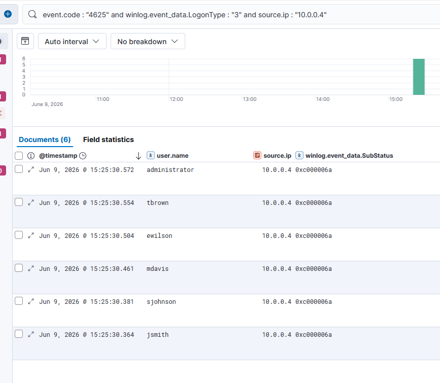

# IR-001 — Password Spraying Detection

**Date:** 09 June 2026  
**Analyst:** Atharva  
**Severity:** High  
**Status:** Resolved (Lab Simulation)  
**MITRE ATT&CK:** T1110.003 — Brute Force: Password Spraying

---

## 1. Alert Summary

> **Analyst Note:** This report documents a simulated attack scenario investigated as a live SOC alert. The investigation was conducted from the analyst's perspective — receiving a fired alert, examining raw log evidence, identifying the attack pattern, and recommending response actions. The attacker's tooling is documented in Section 10 for context only.

Multiple failed authentication attempts were detected against the Domain Controller
(DC01) originating from a single source IP (10.0.0.4) within a compressed timeframe.
The pattern — one password attempted across multiple distinct accounts — is consistent
with a password spraying attack designed to avoid account lockout thresholds.

| Field | Value |
|-------|-------|
| Source IP | 10.0.0.4 (Kali Linux — Attacker) |
| Target Host | DC01.corp.local (10.0.0.10) |
| Protocol | SMB (NTLM Authentication) |
| Event ID | 4625 — An account failed to log on |
| Logon Type | 3 (Network) |
| Authentication Package | NTLM / NtLmSsp |
| First Event | Jun 9, 2026 @ 15:25:30.364 |
| Last Event | Jun 9, 2026 @ 15:25:30.504 |
| Total Failed Attempts | 6 (single spray run) |

---

## 2. Timeline of Events

| Timestamp | Target Account | SubStatus | Port |
|-----------|---------------|-----------|------|
| 15:25:30.364 | jsmith | 0xC000006A (Wrong password) | 46422 |
| 15:25:30.381 | sjohnson | 0xC000006A (Wrong password) | 46438 |
| 15:25:30.461 | mdavis | 0xC000006A (Wrong password) | 46458 |
| 15:25:30.504 | ewilson | 0xC000006A (Wrong password) | 46470 |
| 15:25:30.xxx | tbrown | 0xC000006A (Wrong password) | — |
| 15:25:30.xxx | administrator | 0xC000006A (Wrong password) | — |

**Key Observation:** All 6 attempts occurred within 140 milliseconds from a single
source IP. This is the defining characteristic of automated password spraying —
a human could not attempt 6 accounts in 140ms.

---

## 3. Raw Log Evidence

### Key Fields From Event ID 4625

```
Event ID:          4625
Logon Type:        3 (Network)
Source IP:         10.0.0.4
Source Port:       46422 / 46438 / 46458 / 46470
Target Domain:     corp.local
Target Accounts:   jsmith, sjohnson, mdavis, ewilson, tbrown, administrator
Status:            0xC000006D (Logon failure)
SubStatus:         0xC000006A (Wrong password — account exists)
Auth Package:      NTLM
Logon Process:     NtLmSsp
```

### SubStatus Code Analysis

| Code | Meaning | Accounts |
|------|---------|----------|
| 0xC000006A | Wrong password — account exists | jsmith, sjohnson, mdavis, ewilson, tbrown |
| 0xC0000064 | Account does not exist | administrator (pre-rename) |

### Kibana Evidence



---

## 4. KQL Detection Query

```kql
event.code : "4625"
  and (
    winlog.event_data.SubStatus : "0xc000006a"
    or winlog.event_data.SubStatus : "0xc0000064"
  )
  and winlog.event_data.LogonType : "3"
```

### Enhanced Query — Flag Spray Pattern By Source IP

```kql
event.code : "4625"
  and winlog.event_data.LogonType : "3"
  and (
    winlog.event_data.SubStatus : "0xc000006a"
    or winlog.event_data.SubStatus : "0xc0000064"
  )
  and source.ip : *
```

**Analyst Note:** In a production environment, pair this query with a threshold
alert — e.g. 5+ unique target accounts from the same source IP within 60 seconds
— to reduce false positives from legitimate failed logins.

---

## 5. MITRE ATT&CK Mapping

| Field | Value |
|-------|-------|
| Tactic | Credential Access |
| Technique | T1110 — Brute Force |
| Sub-Technique | T1110.003 — Password Spraying |
| Platform | Windows |
| Data Source | Windows Security Event Log |
| Detection | DS0002 — User Account Authentication |

**Why Password Spraying vs Brute Force:**
Traditional brute force attempts many passwords against one account — triggering
lockout. Password spraying attempts ONE password across MANY accounts — staying
under lockout thresholds. The 140ms window across 6 accounts with a single password
confirms this is spraying, not brute force.

---

## 6. Indicators of Compromise (IOCs)

| Type | Value | Context |
|------|-------|---------|
| Source IP | 10.0.0.4 | Attacker — Kali Linux |
| Target Host | 10.0.0.10 | DC01.corp.local |
| Protocol | SMB port 445 | NTLM authentication |
| Tool | CrackMapExec | Automated spraying tool |
| Accounts Targeted | jsmith, sjohnson, mdavis, ewilson, tbrown, administrator | All domain accounts |

---

## 7. Severity Assessment

**Severity: HIGH**

| Factor | Assessment |
|--------|-----------|
| Source | External attacker IP targeting DC directly |
| Scope | All domain user accounts targeted |
| Speed | 6 accounts in 140ms — clearly automated |
| Target | Domain Controller — highest value target |
| Protocol | NTLM over SMB — legacy protocol, credential exposure risk |
| Outcome | All attempts failed — no successful logon |

Severity is HIGH despite no successful logon. Automated credential spraying against
a DC indicates an attacker with domain user enumeration capability and active
credential harvesting intent.

---

## 8. Recommended Response Actions

**Immediate:**
1. Block source IP 10.0.0.4 at the firewall
2. Force password reset for all targeted accounts as a precaution
3. Review DC01 Security logs for any successful logons from 10.0.0.4
4. Check for Event ID 4624 (successful logon) from same source IP

**Short Term:**
1. Implement account lockout policy — 5 failed attempts within 30 minutes
2. Enable Fine-Grained Password Policy for privileged accounts
3. Disable NTLM authentication where possible — enforce Kerberos
4. Deploy Microsoft Defender for Identity for real-time spray detection

**Long Term:**
1. Implement MFA for all domain accounts
2. Deploy honeypot accounts — fake users that should never authenticate
3. Regularly audit SMB exposure on domain controllers

---

## 9. False Positive Analysis

| Scenario | Why It Could Trigger | How To Tune |
|----------|---------------------|-------------|
| User mistyping password on multiple accounts | Legitimate user with multiple accounts failing login | Add threshold — require 4+ unique accounts from same IP within 60 seconds |
| Helpdesk testing multiple accounts | Internal IT running credential checks | Whitelist known helpdesk IPs from the detection rule |
| Service account misconfiguration | Service trying wrong credentials repeatedly | Filter by excluding known service account names |
| Legacy application using NTLM | App authenticating against multiple endpoints | Exclude known application IPs and service accounts |
| Security scanner / vulnerability assessment | Authorised internal scanning tool | Whitelist scanner IP range during scheduled scan windows |

**Tuning Recommendation:** The raw query will fire on any 4625 with LogonType 3.
In production, wrap this in a threshold alert: 5+ Event 4625 hits from the same
source.ip targeting 3+ unique user.name values within 60 seconds. This eliminates
single mistyped password events while catching genuine spray patterns.

---

## 10. Lessons Learned

1. **NTLM is dangerous** — this attack used NTLM over SMB. Kerberos pre-auth
   would have generated different (and more detectable) events via Event ID 4771.

2. **Speed is the giveaway** — 6 accounts in 140ms is impossible for a human.
   Threshold-based alerting on authentication velocity catches this automatically.

3. **DC exposure** — the Domain Controller was directly reachable from the attacker
   segment with no network segmentation. In production, DC should never be directly
   reachable from workstation VLANs.

4. **SubStatus codes matter** — 0xC000006A (wrong password) vs 0xC0000064
   (unknown user) reveals whether the attacker has valid usernames. In this case
   they did — indicating prior reconnaissance.

---

## 11. Attack Tool Reference

**Tool Used:** CrackMapExec (CME)  
**Command:** `crackmapexec smb 10.0.0.10 -u users.txt -p WrongPassword1`  
**Detection Evasion:** Single password per run avoids account lockout  
**Protocol:** SMB — generates NTLM auth events visible in Security log

---

## 12. Additional Findings During Investigation

During investigation of the password spray alert, 6 additional failed
authentication events were identified originating from WIN10-Victim (10.0.0.20)
targeting account "victim-user" with SubStatus 0xC0000064 (account does not exist).

These events predate the spray activity and were caused by a local account
attempting domain authentication before the domain account was created.

**Resolution:** Domain account created for victim-user in OU=IT,OU=Corp Users,DC=corp,DC=local.
Events are unrelated to T1110.003 activity but were identified during investigation.
This demonstrates the importance of baselining normal authentication failures
to distinguish noise from genuine attack patterns.
