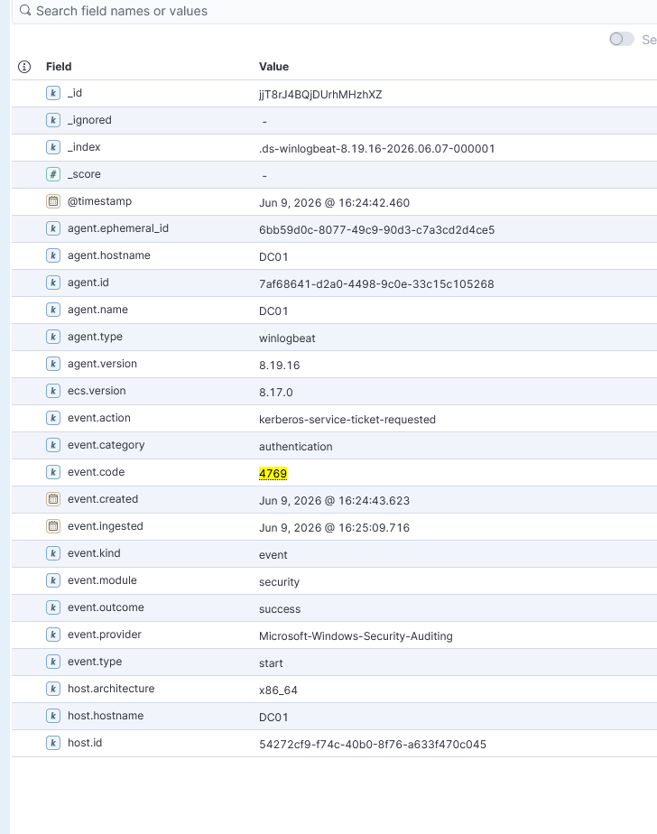

# IR-002 — Kerberoasting Detection

**Date:** 09 June 2026  
**Analyst:** Atharva  
**Severity:** Critical  
**Status:** Resolved (Lab Simulation)  
**MITRE ATT&CK:** T1558.003 — Steal or Forge Kerberos Tickets: Kerberoasting

---

## 1. Alert Summary

> **Analyst Note:** This report documents a simulated attack scenario investigated as a live SOC alert. The investigation was conducted from the analyst's perspective — receiving a fired alert, examining raw log evidence, identifying the attack pattern, and recommending response actions. The attacker's tooling is documented in Section 12 for context only.

A Kerberos service ticket request was detected using RC4-HMAC encryption (0x17)
for a service account (sqlsvc) originating from an attacker-controlled machine
(10.0.0.4). RC4 encryption on a TGS request is the primary indicator of a
Kerberoasting attack — the resulting ticket hash can be cracked offline without
further domain interaction.

| Field | Value |
|-------|-------|
| Requesting Account | jsmith@CORP.LOCAL |
| Service Targeted | sqlsvc (MSSQLSvc/DC01.corp.local:1433) |
| Source IP | 10.0.0.4 (Kali Linux — Attacker) |
| Source Port | 46050 |
| Target Host | DC01.corp.local (10.0.0.10) |
| Event ID | 4769 — Kerberos Service Ticket Requested |
| Encryption Type | 0x17 (RC4-HMAC) |
| Ticket Options | 0x40810010 |
| Timestamp | Jun 9, 2026 @ 15:24:42.460 UTC |

---

## 2. Attack Background

Kerberoasting exploits the Kerberos authentication protocol. Any authenticated
domain user can request a TGS (Ticket Granting Service) ticket for any service
account with a registered SPN. The DC encrypts this ticket with the service
account's password hash. The attacker receives the encrypted ticket and can
crack it offline — no lockout, no noise, no further domain interaction required.

**Why RC4 is the giveaway:**
- Modern environments use AES-256 (0x12) or AES-128 (0x11) encryption
- Attackers force RC4 (0x17) because it is significantly faster to crack offline
- A legitimate service ticket request from a modern client uses AES, not RC4
- RC4 TGS requests for service accounts from non-service machines = Kerberoasting

---

## 3. Timeline of Events

| Timestamp | Event | Detail |
|-----------|-------|--------|
| 15:24:16 | sqlsvc account created on DC01 | Service account with weak password |
| 15:24:16 | SPN registered | MSSQLSvc/DC01.corp.local:1433 → sqlsvc |
| 15:24:42 | TGS requested by jsmith | RC4-HMAC encryption — from 10.0.0.4 |
| 15:24:43 | Ticket delivered by DC01 | Hash returned to attacker |
| Post-attack | Offline cracking begins | No domain interaction required |

---

## 4. Raw Log Evidence

### Event ID 4769 — Key Fields

```
Event ID:              4769
Event Action:          kerberos-service-ticket-requested
Requesting Account:    jsmith@CORP.LOCAL
Logon GUID:            {948ff657-84d7-e538-04e9-2a621f57df70}
Service Name:          sqlsvc
Service SID:           S-1-5-21-30886212-3975828060-3061548020-1110
Client Address:        ::ffff:10.0.0.4
Client Port:           46050
Ticket Options:        0x40810010
Ticket Encryption:     0x17 (RC4-HMAC) ← PRIMARY IOC
Failure Code:          0x0 (Success — ticket was issued)
```

### Extracted TGS Hash (RC4)

```
$krb5tgs$23$*sqlsvc$CORP.LOCAL$corp.local/sqlsvc*$81a2b36c8c896e059f8a24...
[truncated for report — full hash captured during attack simulation]
```

Hash format: **$krb5tgs$23$** — confirms RC4 (etype 23) Kerberoasting hash.
Crackable offline with Hashcat mode **13100**.

### Kibana Evidence



---

## 5. KQL Detection Query

### Primary Detection — RC4 TGS Requests

```kql
event.code : "4769"
  and winlog.event_data.TicketEncryptionType : "0x17"
```

### Enhanced Detection — Exclude Legitimate Service Accounts

```kql
event.code : "4769"
  and winlog.event_data.TicketEncryptionType : "0x17"
  and not winlog.event_data.ServiceName : ("krbtgt" or "*$")
```

> Note: Excluding krbtgt and machine accounts (ending in $) reduces false
> positives from legacy systems that legitimately use RC4.

### Hunting Query — Multiple TGS Requests From Single Source

```kql
event.code : "4769"
  and winlog.event_data.TicketEncryptionType : "0x17"
  and source.ip : "10.0.0.4"
```

---

## 6. MITRE ATT&CK Mapping

| Field | Value |
|-------|-------|
| Tactic | Credential Access |
| Technique | T1558 — Steal or Forge Kerberos Tickets |
| Sub-Technique | T1558.003 — Kerberoasting |
| Platform | Windows — Active Directory |
| Data Source | Windows Security Event Log |
| Detection | DS0026 — Active Directory Object Access |

**Attack Chain Position:**
Kerberoasting sits after initial access and domain enumeration. The attacker
had already compromised jsmith credentials (via password spraying — IR-001)
and used them to Kerberoast service accounts. This links directly to IR-001.

---

## 7. Indicators of Compromise (IOCs)

| Type | Value | Context |
|------|-------|---------|
| Source IP | 10.0.0.4 | Attacker — Kali Linux |
| Requesting User | jsmith@CORP.LOCAL | Compromised domain account |
| Target Service | sqlsvc | Service account with weak password |
| SPN | MSSQLSvc/DC01.corp.local:1433 | Registered SQL service |
| Encryption Type | 0x17 (RC4-HMAC) | Kerberoasting indicator |
| Tool | Impacket GetUserSPNs | Standard Kerberoasting tool |
| Hash Format | $krb5tgs$23$ | Offline crackable with Hashcat 13100 |

---

## 8. Severity Assessment

**Severity: CRITICAL**

| Factor | Assessment |
|--------|-----------|
| Attack Stage | Credential access — post-compromise |
| Stealth | High — uses legitimate Kerberos protocol |
| Noise | Low — single successful event, no failures |
| Impact | Service account password exposed offline |
| Lockout Risk | None — Kerberoasting generates no lockouts |
| Detection Difficulty | Medium — requires monitoring 4769 + RC4 filter |
| Link to IR-001 | jsmith used here was targeted in password spray |

Severity is CRITICAL because successful Kerberoasting gives the attacker an
offline hash they can crack at unlimited speed — potentially compromising
service accounts with elevated privileges.

---

## 9. False Positive Analysis

| Scenario | Why It Could Trigger | How To Tune |
|----------|---------------------|-------------|
| Legacy application using RC4 | Old application servers that don't support AES | Whitelist known legacy service accounts by name |
| Windows XP / Server 2003 clients | Too old to support AES Kerberos | These should not exist in modern environments — flag as separate risk |
| Misconfigured service account | Account not configured for AES support | Run `Set-ADUser -KerberosEncryptionType AES256` on all service accounts |
| Security scanner | Some vulnerability scanners request RC4 tickets | Whitelist scanner service account or IP during scan windows |

**Tuning Recommendation:** The enhanced query already excludes krbtgt and machine
accounts. In production, additionally exclude known legacy service accounts that
legitimately use RC4. Any remaining hits should be treated as high-confidence
Kerberoasting indicators — especially if the requesting account is a standard
user (not a service account) and the source IP is not a domain-joined machine.

---

## 10. Recommended Response Actions

**Immediate:**
1. Reset sqlsvc password immediately — assume it is compromised
2. Audit all service accounts with SPNs — run `setspn -T corp.local -Q */*`
3. Check for any successful logons from sqlsvc after the ticket request
4. Investigate jsmith account — linked to IR-001 password spray

**Short Term:**
1. Enable AES encryption on all service accounts:
   ```powershell
   Set-ADUser sqlsvc -KerberosEncryptionType AES256
   ```
2. Implement Group Managed Service Accounts (gMSA) — auto-rotate passwords
3. Ensure all service account passwords are 25+ characters — increases crack time
4. Set up alerting on Event ID 4769 with TicketEncryptionType 0x17

**Long Term:**
1. Enforce AES-only Kerberos domain-wide via Group Policy
2. Regularly audit SPN registrations — remove unused SPNs
3. Implement Privileged Access Workstations (PAW) for service account management
4. Deploy Microsoft Defender for Identity — detects Kerberoasting automatically

---

## 11. Attack Chain Correlation

This incident is directly linked to **IR-001 — Password Spraying**:

```
IR-001: Password Spray → jsmith credentials obtained (10.0.0.4)
            ↓
IR-002: Kerberoasting → jsmith used to request TGS for sqlsvc (10.0.0.4)
            ↓
IR-003: DCSync → jsmith used to dump full domain credentials
```

The attacker is progressing through the kill chain. IR-001 and IR-002 should
be treated as a single linked incident, not two separate events.

---

## 12. Lessons Learned

1. **RC4 should not exist in modern environments** — enforcing AES-only
   Kerberos eliminates Kerberoasting entirely.

2. **Service accounts are high-value targets** — sqlsvc had a weak password
   (Service123!) that would crack in seconds with Hashcat.

3. **Kerberoasting leaves minimal noise** — one successful Event ID 4769 with
   no failures. Compare to brute force (IR-001) which generated 12+ failure events.
   This is why RC4 filtering is essential.

4. **SPN hygiene matters** — unused or overprivileged SPNs expand the attack
   surface. Every SPN is a potential Kerberoasting target.

5. **Attack chain thinking** — jsmith appeared in IR-001 as a spraying target
   and reappeared here as the requesting account. Correlating across incidents
   reveals the full attacker path.

---

## 13. Tool Reference

**Tool Used:** Impacket GetUserSPNs  
**Command:** `impacket-GetUserSPNs corp.local/jsmith:Password123! -dc-ip 10.0.0.10 -request`  
**Output:** RC4-encrypted TGS hash for sqlsvc  
**Crack Command (reference):** `hashcat -m 13100 hash.txt wordlist.txt`
