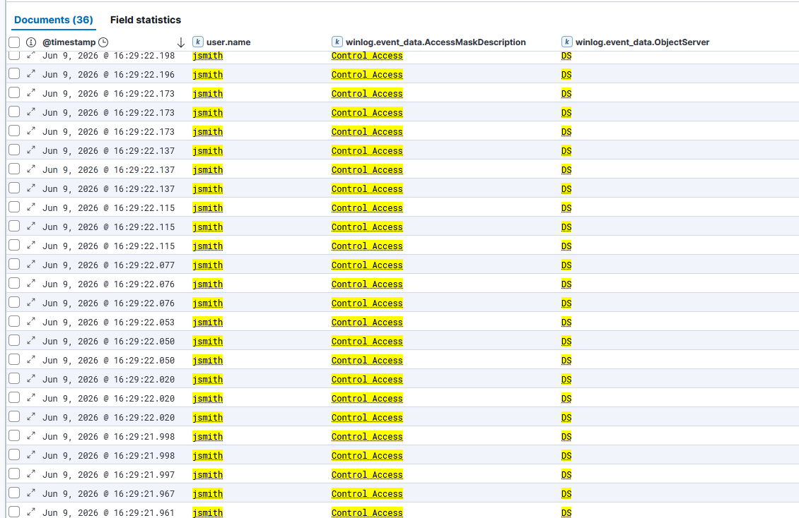

# IR-003 — DCSync Attack Detection

**Date:** 09 June 2026  
**Analyst:** Atharva  
**Severity:** Critical  
**Status:** Resolved (Lab Simulation)  
**MITRE ATT&CK:** T1003.006 — OS Credential Dumping: DCSync

---

## 1. Alert Summary

> **Analyst Note:** This report documents a simulated attack scenario investigated as a live SOC alert. The investigation was conducted from the analyst's perspective — receiving a fired alert, examining raw log evidence, identifying the attack pattern, and recommending response actions. The attacker's tooling is documented in Section 12 for context only.

36 Directory Service replication operations were detected from domain account
jsmith against DC01 within a 327ms window. The volume, speed, and source of
these replication requests are inconsistent with legitimate AD replication —
no Domain Controller was involved as the source. This pattern is consistent
with a DCSync attack using Impacket secretsdump, resulting in the extraction
of every domain credential hash including Administrator and krbtgt.

| Field | Value |
|-------|-------|
| Requesting Account | jsmith (CORP\jsmith) |
| Account SID | S-1-5-21-30886212-3975828060-3061548020-1103 |
| Source Host | 10.0.0.4 (Kali Linux — Attacker) |
| Target Host | DC01.corp.local (10.0.0.10) |
| Event ID | 4662 — Operation Performed on Object |
| Object Server | DS (Directory Services) |
| Access Type | Control Access |
| Access Mask | 0x100 |
| First Event | Jun 9, 2026 @ 16:29:21.871 UTC |
| Last Event | Jun 9, 2026 @ 16:29:22.198 UTC |
| Total Events | 36 replication operations |
| Duration | 327 milliseconds |

---

## 2. Attack Background

DCSync abuses the MS-DRSR (Directory Replication Service Remote Protocol) to
impersonate a Domain Controller and request password data from a real DC.
Any account with the following extended rights can perform DCSync:

- **DS-Replication-Get-Changes** (1131f6aa)
- **DS-Replication-Get-Changes-All** (1131f6ad)

jsmith was a member of Domain Admins — granting these rights implicitly.
The attack requires no malware, no service installation, and no local access
to the DC. It is executed entirely over the network using legitimate AD protocols.

**What was extracted:**
- Administrator NTLM hash
- krbtgt NTLM hash and AES keys — enables Golden Ticket attacks
- All domain user NTLM hashes (jsmith, sjohnson, mdavis, ewilson, tbrown, victim-user)
- sqlsvc NTLM hash
- Machine account hashes (DC01$, WIN10-VICTIM$)

---

## 3. Timeline of Events

| Timestamp | Event | Detail |
|-----------|-------|--------|
| IR-001 | Password Spray | jsmith credentials obtained |
| IR-002 | Kerberoasting | jsmith used to request TGS tickets |
| 16:29:21.871 | DCSync begins | First replication operation by jsmith |
| 16:29:22.198 | DCSync completes | 36 operations — full domain dump |
| Post-attack | krbtgt hash obtained | Golden Ticket attack now possible |

---

## 4. Raw Log Evidence

### Event ID 4662 — Key Fields

```
Event ID:              4662
Event Action:          object-operation-performed
Subject Account:       jsmith (CORP)
Subject SID:           S-1-5-21-30886212-3975828060-3061548020-1103
Object Server:         DS
Object Type:           %{19195a5b-6da0-11d0-afd3-00c04fd930c9} (domainDNS)
Object Name:           %{2df0b9b4-31cd-4d00-b4cb-57c3f6bd41b2}
Operation Type:        Object Access
Access:                Control Access
Access Mask:           0x100
Properties:            %%7688
                       {1131f6ad-9c07-11d1-f79f-00c04fc2dcd2}
                       {19195a5b-6da0-11d0-afd3-00c04fd930c9}
```

### Replication GUIDs Observed

| GUID | Right | Significance |
|------|-------|-------------|
| 1131f6ad | DS-Replication-Get-Changes | Required for DCSync |
| 19195a5b | domainDNS | Entire domain object targeted |

### Credentials Extracted (Partial — From Attack Output)

```
Administrator:500:aad3b435b51404eeaad3b435b51404ee:[redacted]:::
krbtgt:502:aad3b435b51404eeaad3b435b51404ee:[redacted]:::
corp.local\jsmith:1103:[lmhash]:[nthash]:::
[all domain users — full dump obtained]
```

> ⚠️ krbtgt hash exposure means the attacker can forge Golden Tickets — 
> persistent access that survives password resets until krbtgt is reset twice.

### Kibana Evidence



---

## 5. KQL Detection Query

### Primary Detection

```kql
event.code : "4662"
  and user.name : "jsmith"
  and winlog.event_data.AccessMaskDescription : "Control Access"
  and winlog.event_data.ObjectServer : "DS"
```

### Production Detection — Flag Any Non-DC Account Performing Replication

```kql
event.code : "4662"
  and winlog.event_data.AccessMaskDescription : "Control Access"
  and winlog.event_data.ObjectServer : "DS"
  and not user.name : ("DC01$" or "WIN10-VICTIM$")
```

> Note: In production, exclude legitimate DC machine accounts from this query.
> Any human account performing Control Access on DS objects is suspicious.

### Volume-Based Detection — High Velocity Replication

```kql
event.code : "4662"
  and winlog.event_data.ObjectServer : "DS"
  and winlog.event_data.AccessMaskDescription : "Control Access"
```

> Threshold alert: 10+ events from same user.name within 5 seconds = DCSync.
> Legitimate AD replication is machine-to-machine, not user-initiated.

---

## 6. MITRE ATT&CK Mapping

| Field | Value |
|-------|-------|
| Tactic | Credential Access |
| Technique | T1003 — OS Credential Dumping |
| Sub-Technique | T1003.006 — DCSync |
| Platform | Windows — Active Directory |
| Data Source | Windows Security Event Log (DS Access) |
| Required Permissions | DS-Replication-Get-Changes-All |

---

## 7. Indicators of Compromise (IOCs)

| Type | Value | Context |
|------|-------|---------|
| Source IP | 10.0.0.4 | Attacker — Kali Linux |
| Account | jsmith | Domain Admin — abused for replication |
| Event Count | 36 in 327ms | Impossible for legitimate replication |
| Object Server | DS | Directory Services — AD database |
| Access Mask | 0x100 | Control Access — replication right |
| GUID | 1131f6ad | DS-Replication-Get-Changes |
| Tool | Impacket secretsdump | Standard DCSync tool |
| Hashes Extracted | All domain accounts | Including krbtgt and Administrator |

---

## 8. Severity Assessment

**Severity: CRITICAL — Domain Compromise**

| Factor | Assessment |
|--------|-----------|
| Impact | Full domain credential dump |
| krbtgt Exposure | Golden Ticket attacks now possible |
| Administrator Hash | Pass-the-Hash to any domain system |
| Stealth | Uses legitimate AD protocol — no malware |
| Noise | 36 events in 327ms — detectable by volume |
| Remediation Complexity | High — krbtgt must be reset twice |
| Link to IR-001/002 | Third stage of same attacker kill chain |

DCSync is effectively game over for the domain. The attacker has every
credential hash — they can authenticate as any user, forge Kerberos tickets,
and maintain persistent access even after password resets (until krbtgt
is reset twice with a 10-hour gap between resets).

---

## 9. False Positive Analysis

| Scenario | Why It Could Trigger | How To Tune |
|----------|---------------------|-------------|
| Legitimate DC replication | DCs replicate with each other constantly | Exclude machine accounts (DC01$, DC02$) from the query — already in production rule |
| AD Connect / Azure AD Sync | Sync account performs replication operations | Whitelist the MSOL_ or AAD sync service account by name |
| Privileged Identity Management tools | Some PAM tools use replication rights | Whitelist known PAM service accounts |
| Backup software | Some backup tools require DS replication rights | Audit and whitelist specific backup service accounts |

**Tuning Recommendation:** The production detection query already excludes machine
accounts. The main false positive risk is AD Connect sync accounts — in environments
with Azure AD, the MSOL_ account legitimately performs replication operations.
Whitelist this account explicitly. Any remaining hits from human accounts performing
Control Access on DS objects within 5 seconds should be treated as DCSync until
proven otherwise — the false positive rate for this pattern is extremely low.

**Detection Gap Note:** Event 4662 requires "Audit Directory Service Access" to be
enabled in Group Policy. Without this setting, DCSync is completely invisible in
the event logs. Verify this audit policy is enabled in all production environments.

---

## 10. Recommended Response Actions

**Immediate — Execute Within 1 Hour:**
1. Isolate DC01 from network — prevent further replication abuse
2. Reset jsmith password immediately and terminate all active sessions
3. Audit Domain Admins group — remove any unauthorised members
4. Check Event ID 4624 for successful logons using dumped hashes

**Short Term — Execute Within 24 Hours:**
1. Reset krbtgt password **twice** with 10 hours between resets:
   ```powershell
   Set-ADAccountPassword -Identity krbtgt -Reset -NewPassword (ConvertTo-SecureString "NewKrbtgtPass1!" -AsPlainText -Force)
   ```
2. Force password reset for ALL domain accounts — all hashes are compromised
3. Reset Administrator password immediately
4. Audit DS replication permissions — remove from all non-DC accounts:
   ```powershell
   Get-ADUser -Filter * | Get-ACL | Where-Object {$_.Access -match "DS-Replication"}
   ```

**Long Term:**
1. Implement Protected Users security group for all privileged accounts
2. Enable Privileged Access Workstations (PAW) — Domain Admins never log into workstations
3. Deploy Microsoft Defender for Identity — detects DCSync in real time
4. Implement Just-In-Time (JIT) privileged access — no permanent Domain Admins
5. Audit and remove excessive replication permissions quarterly

---

## 11. Attack Chain Correlation

This is the third stage of a single coordinated attack chain:

```
IR-001: Password Spray (T1110.003)
  └── jsmith credentials obtained from 10.0.0.4
        ↓
IR-002: Kerberoasting (T1558.003)  
  └── jsmith used to request TGS for sqlsvc → offline hash
        ↓
IR-003: DCSync (T1003.006) ← THIS INCIDENT
  └── jsmith (Domain Admin) used to dump entire domain
        ↓
IR-004: LSASS Dump / IR-005: PsExec / IR-006: Pass-the-Hash
```

All three incidents originate from 10.0.0.4. This is one attacker
progressing systematically through the kill chain — not three separate events.

---

## 12. Lessons Learned

1. **Domain Admins is too powerful** — jsmith had Domain Admin rights
   specifically to simulate DCSync. In production, no user should be a
   permanent Domain Admin. Use JIT access instead.

2. **36 events in 327ms is obvious in hindsight** — a threshold alert on
   Event 4662 volume would have caught this automatically. The pattern is
   unmistakable once you know what to look for.

3. **krbtgt exposure is catastrophic** — unlike regular user hashes, krbtgt
   compromise requires a complex two-step reset process with a 10-hour gap.
   This is why DCSync is rated as the most severe AD attack.

4. **No malware, no AV detection** — DCSync uses legitimate Windows protocols.
   Traditional endpoint security tools will not flag it. Detection requires
   DS auditing enabled and SIEM monitoring of Event 4662.

5. **DS auditing must be explicitly enabled** — without "Audit Directory
   Service Access" enabled in Group Policy, Event 4662 is never generated.
   This is a common misconfiguration in production environments.

---

## 13. Tool Reference

**Tool Used:** Impacket secretsdump  
**Command:** `impacket-secretsdump 'corp.local/jsmith:Password123!@10.0.0.10'`  
**Method:** DRSUAPI (MS-DRSR protocol)  
**Output:** Full NTDS.DIT dump — all domain hashes + Kerberos keys  
**Prerequisite:** Account with DS-Replication-Get-Changes-All right
