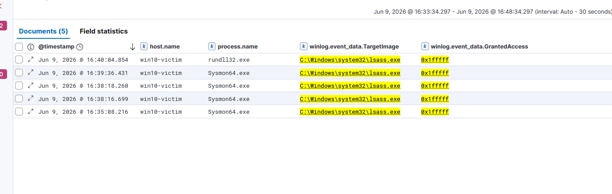

# IR-004 — LSASS Memory Dump Detection

**Date:** 09 June 2026  
**Analyst:** Atharva  
**Severity:** Critical  
**Status:** Resolved (Lab Simulation)  
**MITRE ATT&CK:** T1003.001 — OS Credential Dumping: LSASS Memory

---

## 1. Alert Summary

> **Analyst Note:** This report documents a simulated attack scenario investigated as a live SOC alert. The investigation was conducted from the analyst's perspective — receiving a fired alert, examining raw log evidence, identifying the attack pattern, and recommending response actions. The attacker's tooling is documented in Section 12 for context only.

Sysmon detected rundll32.exe accessing LSASS memory with full access rights
(0x1FFFFF) on WIN10-Victim. The CallTrace confirms comsvcs.dll MiniDump was
used — a living-off-the-land technique that abuses a built-in Windows DLL to
dump LSASS memory to disk without deploying external tools. Windows Defender
was disabled prior to execution, indicating deliberate evasion activity.

| Field | Value |
|-------|-------|
| Source Process | rundll32.exe (PID 8916) |
| Target Process | lsass.exe (PID 672) |
| Source User | WIN10-VICTIM\victim-user |
| Host | WIN10-Victim.corp.local (10.0.0.20) |
| Sysmon Event | 10 — ProcessAccess |
| Granted Access | 0x1FFFFF (Full access) |
| Dump Method | comsvcs.dll MiniDump |
| Output File | C:\Windows\Temp\lsass.dmp |
| Timestamp | Jun 9, 2026 @ 15:40:04.854 UTC |
| Sysmon Rule | technique_id=T1003,technique_name=Credential Dumping |

---

## 2. Attack Background

LSASS (Local Security Authority Subsystem Service) stores credential material
in memory including:
- NTLM password hashes
- Kerberos tickets and keys
- Plaintext passwords (on older systems with WDigest enabled)
- Domain cached credentials

The comsvcs.dll MiniDump method is a living-off-the-land (LOLBin) technique —
it uses a legitimate Windows DLL already present on every system. No external
tools need to be dropped. The command:

```
rundll32.exe comsvcs.dll, MiniDump <lsass_pid> <output.dmp> full
```

This bypasses many endpoint security tools that only flag known offensive
tools like Mimikatz. The resulting .dmp file can be transferred offline and
parsed with pypykatz or Mimikatz to extract credentials.

---

## 3. Timeline of Events

| Timestamp | Event | Detail |
|-----------|-------|--------|
| Pre-attack | Windows Defender disabled | Real-time, behaviour, script, tamper protection all disabled |
| 15:40:04.854 | rundll32 accesses lsass | comsvcs.dll MiniDump — GrantedAccess 0x1FFFFF |
| 15:40:04 | lsass.dmp written to disk | C:\Windows\Temp\lsass.dmp |
| Post-attack | Offline parsing possible | pypykatz / Mimikatz to extract hashes |

---

## 4. Raw Log Evidence

### Sysmon Event ID 10 — Key Fields

```
Event ID:          10 (ProcessAccess)
Rule:              technique_id=T1003,technique_name=Credential Dumping
SourceProcessId:   8916
SourceImage:       C:\Windows\system32\rundll32.exe
TargetProcessId:   672
TargetImage:       C:\Windows\system32\lsass.exe
GrantedAccess:     0x1FFFFF  ← Full memory access
SourceUser:        WIN10-VICTIM\victim-user
TargetUser:        NT AUTHORITY\SYSTEM
```

### CallTrace Analysis

```
C:\Windows\SYSTEM32\ntdll.dll
C:\Windows\SYSTEM32\dbgcore.DLL
C:\Windows\System32\comsvcs.dll+27502  ← MiniDump function
C:\Windows\system32\rundll32.exe
C:\Windows\System32\KERNEL32.DLL
C:\Windows\SYSTEM32\ntdll.dll
```

**comsvcs.dll at offset +27502** confirms MiniDump function was called.
This is the definitive indicator of the LOLBin LSASS dump technique.

### GrantedAccess Mask Breakdown

| Access Right | Value | Meaning |
|-------------|-------|---------|
| PROCESS_ALL_ACCESS | 0x1FFFFF | Full process access — read/write memory |

0x1FFFFF is the highest access level. Legitimate processes accessing LSASS
use significantly lower access masks. Full access is a strong IOC.

### Kibana Evidence



---

## 5. KQL Detection Query

### Primary Detection — rundll32 Accessing LSASS

```kql
event.code : "10"
  and winlog.event_data.TargetImage : "C:\\Windows\\system32\\lsass.exe"
  and agent.hostname : "WIN10-Victim"
  and winlog.event_data.GrantedAccess : "0x1fffff"
```

### Enhanced Detection — Any Process With Full LSASS Access

```kql
event.code : "10"
  and winlog.event_data.TargetImage : "C:\\Windows\\system32\\lsass.exe"
  and winlog.event_data.GrantedAccess : "0x1fffff"
  and not process.name : ("MsMpEng.exe" or "svchost.exe")
```

### CallTrace-Based Detection — comsvcs.dll MiniDump Specifically

```kql
event.code : "10"
  and winlog.event_data.TargetImage : "C:\\Windows\\system32\\lsass.exe"
  and winlog.event_data.CallTrace : "*comsvcs*"
```

> The CallTrace query is the most precise — it specifically identifies the
> comsvcs.dll MiniDump LOLBin technique rather than all LSASS access.

---

## 6. MITRE ATT&CK Mapping

| Field | Value |
|-------|-------|
| Tactic | Credential Access |
| Technique | T1003 — OS Credential Dumping |
| Sub-Technique | T1003.001 — LSASS Memory |
| Platform | Windows |
| Data Source | Sysmon Event ID 10 (ProcessAccess) |
| Defense Evaded | T1562.001 — Disable Windows Defender |

**Secondary Technique Observed:**
- T1562.001 — Impair Defenses: Disable or Modify Tools
  Defender was disabled before the dump — deliberate evasion, not accidental.

---

## 7. Indicators of Compromise (IOCs)

| Type | Value | Context |
|------|-------|---------|
| Source Process | rundll32.exe | LOLBin — legitimate Windows tool |
| Target Process | lsass.exe (PID 672) | Credential store |
| DLL Used | comsvcs.dll | MiniDump method |
| Access Mask | 0x1FFFFF | Full process access |
| Dump File | C:\Windows\Temp\lsass.dmp | Credential dump output |
| Source User | WIN10-VICTIM\victim-user | Local account used |
| Host | WIN10-Victim (10.0.0.20) | Endpoint — not DC |
| Pre-condition | Defender disabled | Evasion activity preceding dump |

---

## 8. Severity Assessment

**Severity: Critical**

| Factor | Assessment |
|--------|-----------|
| Credential Exposure | All cached credentials on WIN10-Victim |
| Technique | LOLBin — no external tools, hard to block |
| Evasion | Defender disabled before execution |
| Dump File | Written to disk — transferable |
| Detection | Sysmon required — native logging insufficient |
| Link to Chain | Fourth stage of coordinated attack |

---

## 9. False Positive Analysis

| Scenario | Why It Could Trigger | How To Tune |
|----------|---------------------|-------------|
| Windows Defender / MsMpEng.exe | AV regularly accesses LSASS for scanning | Exclude MsMpEng.exe and svchost.exe in the enhanced query — already included |
| LSASS monitoring tools | Some PAM and security tools read LSASS | Whitelist specific security tool process names |
| Crash dump generation | WerFault.exe accesses LSASS during crash | Add WerFault.exe to the exclusion list |
| Task Manager (admin) | Admin opening Task Manager can trigger low-access events | 0x1FFFFF is specific enough — Task Manager uses lower access masks |

**Tuning Recommendation:** The 0x1FFFFF GrantedAccess filter is already highly
specific. Very few legitimate processes require full process access to LSASS.
The CallTrace-based query (`*comsvcs*`) is the most precise — it will only fire
on the specific MiniDump LOLBin technique and has near-zero false positive rate.
In production, start with the CallTrace query and expand to the GrantedAccess
query only if additional coverage is needed.

**Production Gap Note:** This detection required Defender to be disabled first.
In a production environment with Tamper Protection enabled, the Defender disable
event (Event 7036 — service stopped, or PowerShell audit logs) would have fired
**before** the dump. The Defender disable event is itself a high-severity alert
that should be treated as a precursor indicator.

---

## 10. Recommended Response Actions

**Immediate:**
1. Isolate WIN10-Victim from network — prevent credential reuse
2. Delete C:\Windows\Temp\lsass.dmp immediately
3. Reset all passwords for accounts that logged into WIN10-Victim
4. Check Event ID 4624 for logons using WIN10-Victim cached credentials
5. Re-enable Windows Defender immediately — check how it was disabled

**Short Term:**
1. Enable LSA Protection to prevent LSASS memory access:
   ```powershell
   reg add HKLM\SYSTEM\CurrentControlSet\Control\Lsa /v RunAsPPL /t REG_DWORD /d 1
   ```
2. Enable Credential Guard via Group Policy
3. Disable WDigest authentication — prevents plaintext password caching:
   ```powershell
   reg add HKLM\SYSTEM\CurrentControlSet\Control\SecurityProviders\WDigest /v UseLogonCredential /t REG_DWORD /d 0
   ```
4. Block rundll32.exe from accessing LSASS via Attack Surface Reduction rules

**Long Term:**
1. Deploy Credential Guard domain-wide
2. Implement application whitelisting — prevent unauthorised rundll32 usage
3. Monitor C:\Windows\Temp for .dmp file creation
4. Enable Tamper Protection on all endpoints — prevents Defender disabling

---

## 11. Attack Chain Correlation

```
IR-001: Password Spray → Attacker gains jsmith credentials
IR-002: Kerberoasting → sqlsvc hash obtained
IR-003: DCSync → Full domain dump from DC01
IR-004: LSASS Dump ← THIS INCIDENT
  └── Local credentials from WIN10-Victim obtained
      Defender disabled (T1562.001) before dump
      comsvcs.dll MiniDump — LOLBin technique
        ↓
IR-005: PsExec Lateral Movement
```

The attacker now has credentials from both the domain level (IR-003)
and the local endpoint level (IR-004). Combined with Defender being
disabled, lateral movement is the logical next step.

---

## 12. Lessons Learned

1. **LOLBins are harder to block than malware** — rundll32 and comsvcs.dll
   are legitimate Windows components. Blocking them breaks functionality.
   Detection via Sysmon CallTrace is more reliable than blocking the binary.

2. **Defender being disabled is itself a high-severity alert** — this should
   have fired before the dump occurred. Tamper Protection prevents this.
   Any endpoint with Defender disabled should trigger immediate investigation.

3. **0x1FFFFF is never legitimate for non-system processes** — a threshold
   alert on GrantedAccess 0x1FFFFF against lsass.exe would catch this
   regardless of which tool is used.

4. **Sysmon is essential** — Windows native logging does not capture
   ProcessAccess events. Without Sysmon Event 10, this attack is invisible.

5. **Temp directory is a red flag** — writing a .dmp file to C:\Windows\Temp
   is suspicious. Monitoring for large file creation in temp directories
   catches this class of attack.

---

## 13. Tool Reference

**Method:** Living-off-the-Land (LOLBin)  
**Binary:** rundll32.exe (legitimate Windows tool)  
**DLL:** comsvcs.dll MiniDump function  
**Command:** `rundll32.exe C:\Windows\System32\comsvcs.dll, MiniDump 672 C:\Windows\Temp\lsass.dmp full`  
**Output Parsing:** pypykatz or Mimikatz offline  
**Evasion:** Windows Defender disabled prior to execution
