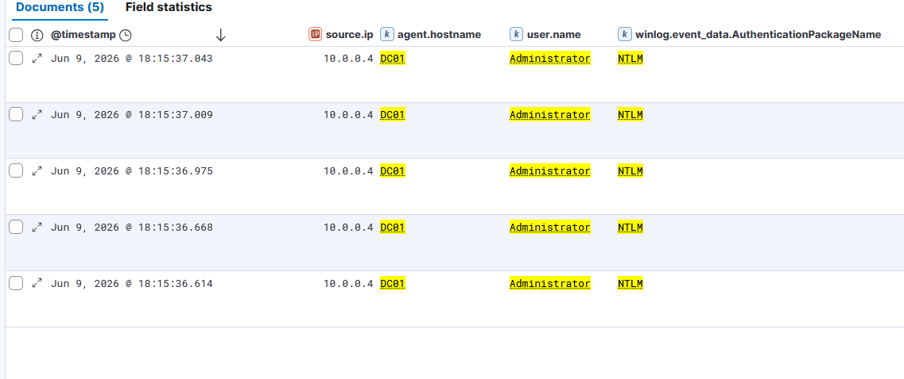

# IR-006 — Pass-the-Hash Detection

**Date:** 09 June 2026  
**Analyst:** Atharva  
**Severity:** Critical  
**Status:** Resolved (Lab Simulation)  
**MITRE ATT&CK:** T1550.002 — Use Alternate Authentication Material: Pass the Hash

---

## 1. Alert Summary

> **Analyst Note:** This report documents a simulated attack scenario investigated as a live SOC alert. The investigation was conducted from the analyst's perspective — receiving a fired alert, examining raw log evidence, identifying the attack pattern, and recommending response actions. The attacker's tooling is documented in Section 12 for context only.

Five successful NTLM network logons were detected on DC01 from source IP
10.0.0.4 (Kali Linux) as Administrator within a 429-millisecond window.
The authentication used NTLM rather than Kerberos — the definitive indicator
of Pass-the-Hash. No password was used; the attacker authenticated using only
the Administrator NTLM hash obtained from the DCSync attack (IR-003).

| Field | Value |
|-------|-------|
| Source IP | 10.0.0.4 (Kali Linux — Attacker) |
| Target Host | DC01.corp.local (10.0.0.10) |
| Account | Administrator |
| Event ID | 4624 — Successful Logon |
| Logon Type | 3 (Network) |
| Auth Package | NTLM |
| Tool Used | Evil-WinRM |
| First Event | Jun 9, 2026 @ 18:15:36.614 UTC |
| Last Event | Jun 9, 2026 @ 18:15:37.043 UTC |
| Duration | 429 milliseconds |
| Total Events | 5 successful logons |

---

## 2. Attack Background

Pass-the-Hash (PtH) exploits NTLM authentication — instead of providing a
plaintext password, the attacker provides the password hash directly. Windows
accepts the hash as valid authentication because NTLM uses the hash as the
authentication credential, not the plaintext password.

**Why this is critical:**
- The attacker never needs to crack the Administrator password
- Hash obtained from DCSync (IR-003) is used directly
- No lockout occurs — authentication succeeds immediately
- Works even if the Administrator password is changed (hash changes too,
  but the attacker already has the new hash from DCSync)

**Tool used:** Evil-WinRM  
Evil-WinRM passes the NTLM hash over WinRM (port 5985) to authenticate.
The result is a full PowerShell session on DC01 as CORP\Administrator.

---

## 3. Timeline of Events

| Timestamp | Event | Source | Target |
|-----------|-------|--------|--------|
| IR-003 | DCSync — Admin hash obtained | 10.0.0.4 | DC01 |
| 18:15:36.614 | PtH logon 1 — Administrator | 10.0.0.4 | DC01 |
| 18:15:36.668 | PtH logon 2 — Administrator | 10.0.0.4 | DC01 |
| 18:15:36.975 | PtH logon 3 — Administrator | 10.0.0.4 | DC01 |
| 18:15:37.009 | PtH logon 4 — Administrator | 10.0.0.4 | DC01 |
| 18:15:37.043 | PtH logon 5 — Administrator | 10.0.0.4 | DC01 |

**Key Observation:** 5 successful logons in 429ms from the same non-Windows
source IP using NTLM. A human authenticating interactively cannot produce
5 complete NTLM handshakes in under half a second.

---

## 4. Raw Log Evidence

### Event ID 4624 — Key Fields

```
Event ID:              4624
Logon Type:            3 (Network)
Account Name:          Administrator
Account Domain:        CORP
Source IP:             10.0.0.4
Authentication Package: NTLM  ← Primary IOC
Logon Process:         NtLmSsp
Key Length:            0
```

### NTLM vs Kerberos — Why NTLM Is Suspicious Here

| Factor | Expected | Observed |
|--------|----------|----------|
| Auth package for domain admin | Kerberos | **NTLM** |
| Source of logon | Domain-joined machine | **Non-domain Kali Linux** |
| Logon frequency | Single logon | **5 in 429ms** |
| Key length | 128 (Kerberos) | **0 (NTLM hash)** |

A domain-joined Windows machine authenticating to the DC uses Kerberos by
default. NTLM is used when the source cannot perform Kerberos — such as a
Linux machine passing a raw hash.

### Kibana Evidence



---

## 5. KQL Detection Query

### Primary Detection — NTLM Logon As Admin From Non-DC Source

```kql
event.code : "4624"
  and winlog.event_data.LogonType : "3"
  and user.name : "Administrator"
  and agent.hostname : "DC01"
  and winlog.event_data.AuthenticationPackageName : "NTLM"
  and source.ip : "10.0.0.4"
```

### Broader Detection — Any NTLM Logon To DC From Non-Windows Source

```kql
event.code : "4624"
  and winlog.event_data.LogonType : "3"
  and winlog.event_data.AuthenticationPackageName : "NTLM"
  and agent.hostname : "DC01"
  and not source.ip : ("10.0.0.10" or "10.0.0.20" or "127.0.0.1")
```

### Velocity Detection — Multiple NTLM Logons In Short Window

```kql
event.code : "4624"
  and winlog.event_data.AuthenticationPackageName : "NTLM"
  and winlog.event_data.LogonType : "3"
  and agent.hostname : "DC01"
```

> Threshold alert: 3+ successful NTLM logons from same source.ip to DC
> within 5 seconds = Pass-the-Hash indicator.

---

## 6. MITRE ATT&CK Mapping

| Field | Value |
|-------|-------|
| Tactic | Lateral Movement / Defense Evasion |
| Technique | T1550 — Use Alternate Authentication Material |
| Sub-Technique | T1550.002 — Pass the Hash |
| Platform | Windows |
| Data Source | Windows Security Event Log |
| Detection | DS0002 — User Account Authentication |
| Prerequisite | NTLM hash (from IR-003 DCSync) |

---

## 7. Indicators of Compromise (IOCs)

| Type | Value | Context |
|------|-------|---------|
| Source IP | 10.0.0.4 | Attacker — Kali Linux (non-Windows) |
| Target Host | DC01 (10.0.0.10) | Domain Controller |
| Account | Administrator | Highest privilege domain account |
| Auth Package | NTLM | Should be Kerberos for domain admin |
| Hash Used | [redacted] | Administrator NT hash from DCSync |
| Tool | Evil-WinRM | Pass-the-Hash over WinRM |
| Logon Count | 5 in 429ms | Automated — impossible manually |
| Port | 5985 (WinRM) | Remote management protocol |

---

## 8. Severity Assessment

**Severity: Critical**

| Factor | Assessment |
|--------|-----------|
| Target | Domain Controller — highest value asset |
| Account | Administrator — full domain control |
| Authentication | Bypasses password entirely — hash only |
| Access Granted | Full PowerShell session on DC01 as SYSTEM |
| Persistence | Hash remains valid until password changed |
| Link to Chain | Direct use of IR-003 DCSync output |

---

## 9. False Positive Analysis

| Scenario | Why It Could Trigger | How To Tune |
|----------|---------------------|-------------|
| Legacy application using NTLM to DC | Old app authenticating against DC | Identify and whitelist known legacy application IPs |
| Helpdesk tool using NTLM | Support tools that don't support Kerberos | Whitelist helpdesk server IPs from the DC-targeted query |
| Linux-based monitoring tools | Some monitoring agents use NTLM | Whitelist known monitoring agent IPs |
| Network printer authentication | Printers authenticating via NTLM | Whitelist printer IP ranges |

**Tuning Recommendation:** The primary query (source.ip : "10.0.0.4") is lab-specific
and not suitable for production. The broader detection query excludes known internal
IPs but will still fire on any new IP using NTLM to the DC. In production, maintain
a whitelist of approved NTLM sources (legacy apps, monitoring tools, printers) and
alert on anything outside that list.

The velocity detection is the most production-ready rule — 3+ NTLM logons from the
same IP within 5 seconds to a DC is a near-certain indicator regardless of the
source IP. This catches PtH tools even from whitelisted IPs if they behave
unusually. The 429ms window observed here would trigger immediately.

---

## 10. Recommended Response Actions

**Immediate:**
1. Reset Administrator password immediately — invalidates current hash
2. Audit all active WinRM sessions on DC01:
   ```powershell
   Get-WSManInstance -ResourceURI Shell -Enumerate
   ```
3. Block WinRM (port 5985/5986) from non-management IPs at firewall
4. Check for any commands run during the WinRM session — Event ID 4688

**Short Term:**
1. Disable NTLM authentication on Domain Controllers via Group Policy:
   - Computer Configuration → Windows Settings → Security Settings →
     Local Policies → Security Options →
     "Network security: Restrict NTLM: Incoming NTLM traffic" → Deny All
2. Enable Protected Users security group for Administrator — forces Kerberos
3. Implement credential tiering — T0 (DC) credentials never used on T1/T2 systems
4. Rename built-in Administrator account — reduces target surface

**Long Term:**
1. Implement Microsoft LAPS — unique local admin passwords per machine
2. Deploy Microsoft Defender for Identity — detects PtH in real time
3. Enforce MFA for all privileged account logons
4. Network segmentation — WinRM access to DC only from jump servers

---

## 11. Attack Chain Correlation

```
IR-001: Password Spray → jsmith credentials obtained
IR-002: Kerberoasting → sqlsvc hash cracked
IR-003: DCSync → ALL hashes dumped including Administrator
IR-004: LSASS Dump → WIN10-Victim local credentials
IR-005: PsExec → SYSTEM shell on WIN10-Victim
IR-006: Pass-the-Hash ← THIS INCIDENT
  └── Administrator NTLM hash from IR-003 used directly
      No password cracking required
      Full access to DC01 via WinRM
        ↓
IR-007: Scheduled Task Persistence
```

Pass-the-Hash closes the loop — the attacker now has interactive access to
the Domain Controller without ever cracking a single password. The entire
attack chain from IR-001 to IR-006 required cracking zero passwords.

---

## 12. Lessons Learned

1. **NTLM is the enabler** — every attack in this chain that involved
   lateral movement used NTLM. Disabling NTLM breaks PtH entirely.
   Modern environments should enforce Kerberos only.

2. **Hash = password** — from an attacker's perspective, the NTLM hash
   IS the credential. Password complexity requirements are irrelevant
   if the hash can be stolen via DCSync or LSASS dumping.

3. **WinRM exposes DC unnecessarily** — the Domain Controller had WinRM
   accessible from any IP on the network. Management protocols should
   only be reachable from dedicated jump servers.

4. **Zero passwords cracked in this chain** — the attacker went from
   initial access (IR-001) to full DC control (IR-006) without cracking
   a single password. Detection must focus on behaviour, not password policy.

5. **429ms is the tell** — five complete NTLM authentication handshakes
   in under half a second from a single source is physically impossible
   for a human. Velocity-based detection catches this automatically.

---

## 13. Tool Reference

**Tool Used:** Evil-WinRM  
**Command:** `evil-winrm -i 10.0.0.10 -u Administrator -H [redacted]`  
**Protocol:** WinRM (port 5985)  
**Authentication:** NTLM hash — no password required  
**Result:** Full interactive PowerShell session on DC01 as Administrator  
**Hash Source:** IR-003 DCSync output
