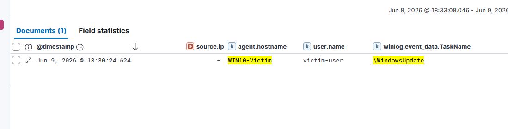

# IR-007 — Scheduled Task Persistence Detection

**Date:** 09 June 2026  
**Analyst:** Atharva  
**Severity:** High  
**Status:** Resolved (Lab Simulation)  
**MITRE ATT&CK:** T1053.005 — Scheduled Task/Job: Scheduled Task

---

## 1. Alert Summary

> **Analyst Note:** This report documents a simulated attack scenario investigated as a live SOC alert. The investigation was conducted from the analyst's perspective — receiving a fired alert, examining raw log evidence, identifying the attack pattern, and recommending response actions. The attacker's tooling is documented in Section 12 for context only.

A scheduled task named "\WindowsUpdate" was created on WIN10-Victim by
victim-user at 18:30:24 UTC. The task is configured to execute cmd.exe
as SYSTEM on every user logon — establishing persistent access that survives
reboots. The task name deliberately mimics a legitimate Windows Update process
to evade casual inspection.

| Field | Value |
|-------|-------|
| Host | WIN10-Victim.corp.local (10.0.0.20) |
| Created By | WIN10-VICTIM\victim-user |
| Task Name | \WindowsUpdate |
| Command | cmd.exe /c whoami > C:\Windows\Temp\persist.txt |
| Run As | SYSTEM (S-1-5-18) |
| Trigger | OnLogon |
| Event ID | 4698 — Scheduled Task Created |
| Timestamp | Jun 9, 2026 @ 18:30:24.624 UTC |

---

## 2. Attack Background

Scheduled Task persistence is one of the most common post-exploitation
techniques. After gaining access to a system the attacker creates a task
that re-executes their payload automatically — surviving reboots, user
logoffs, and most remediation attempts that don't specifically audit tasks.

**Why "\WindowsUpdate" is suspicious:**
- Legitimate Windows Update tasks are named under \Microsoft\Windows\
  not directly under the root \
- The task runs as SYSTEM — unnecessarily high privilege for a "update" task
- The trigger is OnLogon — not a schedule typical for update processes
- The command writes to C:\Windows\Temp — a common attacker staging directory

**In a real attack:** the command would be a reverse shell, a backdoor binary,
or a scheduled credential harvest — not a whoami. The whoami here demonstrates
the persistence mechanism without deploying actual malware.

---

## 3. Timeline of Events

| Timestamp | Event | Detail |
|-----------|-------|--------|
| IR-001-006 | Full domain compromise | Attacker has SYSTEM on WIN10-Victim |
| 10:30:24 (local) | First task creation | Audit policy not yet enabled — missed |
| Audit policy enabled | auditpol configured | Other Object Access Events enabled |
| 18:30:24 UTC | Task recreated | Event 4698 captured in Kibana |
| On next logon | Task executes | cmd.exe runs as SYSTEM — persist.txt written |

---

## 4. Raw Log Evidence

### Event ID 4698 — Key Fields

```
Event ID:          4698
Task Name:         \WindowsUpdate
Account Name:      victim-user
Account Domain:    WIN10-VICTIM
Logon ID:          0xF3FBB
Author:            WIN10-VICTIM\victim-user
Command:           cmd.exe
Arguments:         /c whoami > C:\Windows\Temp\persist.txt
Run As:            S-1-5-18 (SYSTEM)
Trigger:           LogonTrigger
Start Boundary:    2026-06-09T10:30:00
```

### Task XML — Suspicious Elements

```xml
<Triggers>
  <LogonTrigger>           ← Runs on every logon — persistence
    <Enabled>true</Enabled>
  </LogonTrigger>
</Triggers>
<Actions>
  <Exec>
    <Command>cmd.exe</Command>
    <Arguments>/c whoami > C:\Windows\Temp\persist.txt</Arguments>
  </Exec>
</Actions>
<Principals>
  <Principal>
    <UserId>S-1-5-18</UserId>  ← SYSTEM — maximum privilege
  </Principal>
</Principals>
```

### Red Flags In Task Configuration

| Element | Value | Why Suspicious |
|---------|-------|---------------|
| Task path | \WindowsUpdate | Root path — legitimate tasks under \Microsoft\Windows\ |
| Run as | SYSTEM | Unnecessarily high for this task |
| Trigger | OnLogon | Persistence — not a scheduled time |
| Command | cmd.exe | Generic shell — not a named application |
| Output path | C:\Windows\Temp | Common attacker staging directory |

### Kibana Evidence



---

## 5. KQL Detection Query

### Primary Detection — Suspicious Scheduled Task Creation

```kql
event.code : "4698"
  and agent.hostname : "WIN10-Victim"
  and winlog.event_data.TaskName : "\\WindowsUpdate"
```

### Broader Detection — Tasks Not Under Microsoft Path

```kql
event.code : "4698"
  and not winlog.event_data.TaskName : "\\Microsoft\\*"
```

### High-Fidelity Detection — SYSTEM Tasks Created By Standard Users

```kql
event.code : "4698"
  and not user.name : ("SYSTEM" or "Administrator")
  and winlog.event_data.TaskContent : "*S-1-5-18*"
```

> This query flags any task created by a non-admin user that runs as SYSTEM —
> a near-certain indicator of privilege abuse or attacker persistence.

### Sysmon-Based Detection — Task Execution

```kql
event.code : "1"
  and process.parent.name : "svchost.exe"
  and process.name : "cmd.exe"
  and agent.hostname : "WIN10-Victim"
```

---

## 6. MITRE ATT&CK Mapping

| Field | Value |
|-------|-------|
| Tactic | Persistence / Privilege Escalation |
| Technique | T1053 — Scheduled Task/Job |
| Sub-Technique | T1053.005 — Scheduled Task |
| Secondary Tactic | Defense Evasion (T1036 — Masquerading) |
| Platform | Windows |
| Data Source | Windows Security Event Log (Event 4698) |
| Privilege Required | Standard user (to create) — SYSTEM (to execute) |

**Secondary Technique:**
- T1036.004 — Masquerade Task or Service
  Task name "\WindowsUpdate" impersonates a legitimate Windows process.

---

## 7. Indicators of Compromise (IOCs)

| Type | Value | Context |
|------|-------|---------|
| Host | WIN10-Victim (10.0.0.20) | Persistence target |
| Task Name | \WindowsUpdate | Root path — masquerading as Windows Update |
| Created By | victim-user | Standard user creating SYSTEM task |
| Command | cmd.exe | Generic shell execution |
| Run As | S-1-5-18 (SYSTEM) | Maximum privilege |
| Trigger | OnLogon | Executes every logon — persistence |
| Output | C:\Windows\Temp\persist.txt | Attacker staging directory |

---

## 8. Severity Assessment

**Severity: High**

| Factor | Assessment |
|--------|-----------|
| Persistence | Survives reboots and logoffs |
| Privilege | Runs as SYSTEM — full local control |
| Stealth | Name mimics legitimate Windows process |
| Detection | Requires Event 4698 audit enabled |
| Remediation | Simple — delete task and audit policy |
| Context | Final stage of coordinated attack chain |

Severity is High rather than Critical because this is a persistence mechanism —
the attacker already has full access (IR-001 through IR-006). This task
maintains that access rather than escalating it further.

---

## 9. False Positive Analysis

| Scenario | Why It Could Trigger | How To Tune |
|----------|---------------------|-------------|
| Legitimate software creating scheduled tasks | Installers often create tasks for updates | Check task path — legitimate software uses \Microsoft\ or vendor-named paths, not root \ |
| IT admin creating maintenance tasks | Sysadmin creating a SYSTEM task for maintenance | Whitelist specific admin accounts and task names created during change windows |
| Windows Update itself | Creates and modifies tasks under \Microsoft\Windows\WindowsUpdate | The path \WindowsUpdate (root) vs \Microsoft\Windows\WindowsUpdate is the discriminator |
| Security tools | Some AV/EDR products create SYSTEM tasks | Whitelist known security product task names |

**Tuning Recommendation:** The high-fidelity query (SYSTEM task created by
non-admin user) has very low false positive rate. In production, nearly all
legitimate SYSTEM-level tasks are created by the SYSTEM account or Administrator
during software installation — not by standard domain users. Any standard user
creating a SYSTEM task outside a defined change window should be treated as
high-severity immediately.

**Audit Policy Note:** This detection required manual audit policy configuration
(`auditpol /set /subcategory:"Other Object Access Events"`). In production,
enforce this via Group Policy on all endpoints — without it, Event 4698 is
never generated and scheduled task persistence is completely invisible.
The first task creation in this lab was missed because the audit policy was
not pre-configured — a real-world gap that would allow an attacker to establish
persistence undetected.

---

## 10. Recommended Response Actions

**Immediate:**
1. Delete the malicious scheduled task:
   ```powershell
   schtasks /delete /tn "WindowsUpdate" /f
   ```
2. Audit all scheduled tasks on WIN10-Victim for other malicious entries:
   ```powershell
   Get-ScheduledTask | Where-Object {$_.TaskPath -eq "\"} | Select-Object TaskName, TaskPath
   ```
3. Check C:\Windows\Temp for persist.txt and any other attacker files
4. Verify no other persistence mechanisms exist (registry run keys, services)

**Short Term:**
1. Enable scheduled task auditing via Group Policy permanently
2. Implement AppLocker or WDAC to restrict what can run via scheduled tasks
3. Monitor Event 4698 with alerting for tasks created outside change windows
4. Restrict standard users from creating tasks that run as SYSTEM

**Long Term:**
1. Enforce principle of least privilege — standard users cannot create SYSTEM tasks
2. Implement scheduled task whitelisting via Group Policy
3. Deploy Autoruns monitoring to detect persistence mechanisms automatically
4. Regular scheduled task audits as part of threat hunting routine

---

## 11. Attack Chain — Complete Kill Chain Summary

This is the final stage of the attack. The complete kill chain:

```
T1110.003  IR-001: Password Spray
               └── jsmith credentials obtained from 10.0.0.4

T1558.003  IR-002: Kerberoasting
               └── sqlsvc TGS hash obtained — offline crackable

T1003.006  IR-003: DCSync
               └── ALL domain hashes dumped — krbtgt, Administrator, all users

T1003.001  IR-004: LSASS Dump
               └── Local WIN10-Victim credentials dumped via comsvcs.dll

T1021.002  IR-005: PsExec Lateral Movement
               └── SYSTEM shell on WIN10-Victim via SMB

T1550.002  IR-006: Pass-the-Hash
               └── Admin hash used directly — no password cracking

T1053.005  IR-007: Scheduled Task Persistence ← THIS INCIDENT
               └── \WindowsUpdate task — SYSTEM on logon — survives reboot
```

**The attacker achieved:**
- Full domain credential dump
- SYSTEM access on WIN10-Victim
- Administrator access on DC01
- Persistent access surviving reboots
- Zero passwords cracked throughout the entire chain

---

## 12. Lessons Learned

1. **Audit policy gaps create blind spots** — Event 4698 requires explicit
   audit policy configuration. Default Windows settings do not log scheduled
   task creation. This gap allowed the first task creation to go undetected.

2. **Task names are not validated** — Windows allows any name including names
   that impersonate legitimate system processes. Detection must be pattern-based
   not name-based.

3. **SYSTEM is never appropriate for user-created tasks** — any scheduled
   task created by a standard user account that runs as SYSTEM should be
   treated as high-severity automatically.

4. **Persistence is the last step** — by the time a persistence mechanism
   is planted, the attacker has already completed their primary objectives.
   Earlier detection (IR-001 through IR-005) would have prevented this.

5. **C:\Windows\Temp is a red flag** — attackers consistently use temp
   directories for staging, output, and payload storage. File creation
   monitoring in temp directories catches multiple attack techniques.

---

## 13. Tool Reference

**Method:** Native Windows schtasks utility  
**Command:** `schtasks /create /tn "WindowsUpdate" /tr "cmd.exe /c whoami > C:\Windows\Temp\persist.txt" /sc onlogon /ru SYSTEM /f`  
**Evasion:** Task name masquerades as legitimate Windows Update  
**Persistence Type:** OnLogon trigger — executes every user logon  
**Privilege:** SYSTEM — maximum local privilege  
**Detection Requirement:** Audit policy "Other Object Access Events" must be enabled
